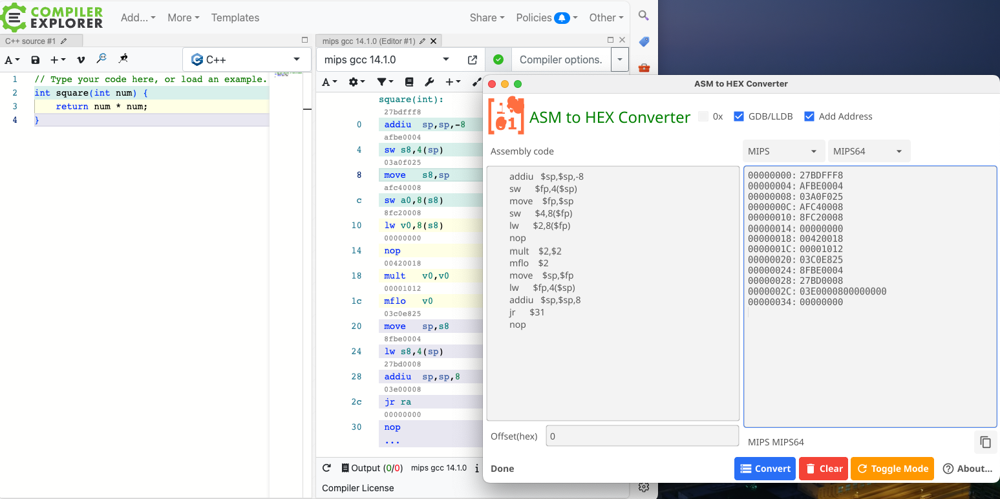
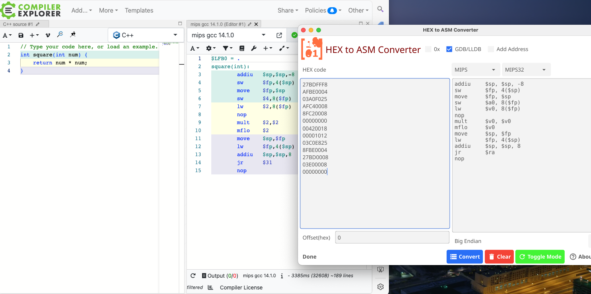

> The new version is refactored using C++ (cpp), while the original version was developed using Golang. A cross-platform GUI tool for converting between Assembly and Machine Code (Hex), powered by Keystone Engine and Capstone Engine.
[v2-asm2hex2](https://github.com/suifei/asm2hex2)
> 新版本使用C ++（cpp）重构，而原始版本是使用Golang开发的。一个跨平台的GUI工具，用于在Assembly和机器代码（Hex）之间进行转换，由Keystone Engine和Capstone Engine提供支持。
> 新版本将提供更加详细的汇编信息，请勾选“Verbose“进行查看，每次记住点一下”Assembie"或"Disassembie"按钮。
> 采用C++ 使用wxWidgets 3.2.2版本进行重构，一样跨平台运行，并兼容 Windows 7。

# v2-asm2hex2

[](https://git.io/streak-stats)

[](https://github.com/suifei/asm2hex/actions/workflows/main.yml)
[](https://github.com/suifei/asm2hex)
[](https://github.com/suifei/asm2hex)
[](https://github.com/suifei?tab=followers)
[](https://twitter.com/csuifei)

[](https://goreportcard.com/report/github.com/suifei/asm2hex)
[](LICENSE)
[](https://pkg.go.dev/github.com/suifei/asm2hex)
[](https://github.com/suifei/asm2hex/releases)
[](https://github.com/suifei/asm2hex/releases)
[](https://github.com/suifei/asm2hex)
[](https://github.com/suifei/asm2hex)
[](https://github.com/suifei/asm2hex)

A powerful cross-platform GUI tool for Assembly-Machine Code conversion, reborn with C++.

## What's New in V2

The v2-asm2hex2 has been completely rewritten in C++, marking a significant evolution from its Golang predecessor. This new version brings enhanced performance, broader compatibility, and richer features while maintaining the same intuitive experience.

### Key Features
- **Enhanced Assembly Information**: New "Verbose" mode provides detailed assembly analysis
- **Cross-Platform Compatibility**: Built with wxWidgets 3.2.2, ensuring consistent experience across different operating systems
- **Extended OS Support**: Compatible down to Windows 7 and equivalent systems
- **Powerful Engine Integration**: Leveraging Keystone Engine for assembly and Capstone Engine for disassembly
- **User-Friendly Interface**: Clean, intuitive GUI with simple "Assemble" and "Disassemble" operations

### Core Functions
- Assembly to Machine Code (Hex) conversion
- Machine Code to Assembly decompilation
- Detailed instruction analysis in Verbose mode
- Real-time conversion with single-click operation

---

中文版说明：

# v2-asm2hex2

一款功能强大的跨平台汇编代码转换工具，采用C++全新重构。

## V2 版本更新

v2-asm2hex2 已完全使用C++重写，相比前代Golang版本带来了显著的进化。新版本不仅提供了更优的性能和更广的兼容性，还增添了丰富的新功能，同时保持了直观的使用体验。

### 核心特性
- **增强的汇编信息**: 新增"Verbose"模式，提供详尽的汇编分析
- **真正的跨平台**: 基于 wxWidgets 3.2.2 构建，确保各操作系统下的一致体验
- **扩展的系统支持**: 向下兼容至 Windows 7 及同等系统
- **强大的引擎支持**: 集成 Keystone Engine 和 Capstone Engine 双引擎
- **友好的用户界面**: 简洁直观的界面设计，一键即可完成转换

### 核心功能
- 汇编代码转机器码（Hex）
- 机器码反编译为汇编代码
- Verbose 模式下的详细指令分析
- 单击按钮即可实时转换

---

> 💡 Quick Tip: Enable "Verbose" mode for detailed assembly analysis. Remember to click "Assemble" or "Disassemble" button after making changes.

# ASM2HEX

ASM2HEX是一款用Go语言编写的,基于Fyne框架开发的汇编语言与十六进制机器码相互转换的图形化工具。它支持ARM64、ARM和Thumb三种指令集。

## 支持的汇编指令集

下表列出了当前版本支持的汇编指令集以及对应的汇编器(Keystone)和反汇编器(Capstone)的支持情况:

| 指令集     | 架构       | 汇编(Keystone) | 反汇编(Capstone) |
|------------|------------|----------------|-----------------|
| ARM        | ARM        | ✓              | ✓               |
| ARM64      | ARM64      | ✓              | ✓               |
| MIPS       | MIPS       | ✓              | ✓               |
| X86        | X86        | ✓              | ✓               |
| PPC        | PPC        | ✓              | ✓               |
| SPARC      | SPARC      | ✓              | ✓               |
| SystemZ    | SYSTEMZ    | ✓              | ✓               |
| Hexagon    | HEXAGON    | ✓              | ✗               |
| EVM        | EVM        | ✓              | ✓               |
| XCORE      | XCORE      | ✗              | ✓               |
| M68K       | M68K       | ✗              | ✓               |
| TMS320C64X | TMS320C64X | ✗              | ✓               |
| M680X      | M680X      | ✗              | ✓               |
| MOS65XX    | MOS65XX    | ✗              | ✓               |
| WASM       | WASM       | ✗              | ✓               |
| BPF        | BPF        | ✗              | ✓               |
| RISCV      | RISCV      | ✗              | ✓               |
| SH         | SH         | ✗              | ✓               |
| TriCore    | TRICORE    | ✗              | ✓               |

✓ 表示支持该指令集,✗ 表示不支持该指令集。


## v1.2.0 版本更新说明

### 新增功能

- 增加了对多种指令集，架构汇编、反汇编的支持,现在可以在主界面上选择。
- 支持多种汇编指令集,包括 ARM、ARM64、MIPS、X86、PPC、SPARC、SystemZ、Hexagon 和 EVM。
- 提供了统一的接口,可以方便地进行汇编和反汇编操作。







### 改进

- 优化了代码结构,提高了代码的可读性和可维护性。
- 改进了错误处理机制,提供更友好的错误提示信息。
- 发布了 github actions 自动化构建流程,保证了代码质量和稳定性。

### 修复

- 修复了一些潜在的 bug 和稳定性问题。

### 其他

- 更新了文档和示例代码,方便用户快速上手使用。

希望这次更新能够为用户带来更好的使用体验,如果您在使用过程中遇到任何问题或有任何建议,欢迎向我们反馈。

[**Full Changelog**](https://github.com/suifei/asm2hex/compare/v1.1...main)

## 功能特点

- 支持ARM64、ARM和Thumb指令集的汇编语言与十六进制机器码的双向转换
- 可自定义偏移地址,支持大端和小端两种字节序
- 使用Keystone作为汇编引擎,Capstone作为反汇编引擎,转换准确可靠
- 基于Fyne框架开发的现代化图形界面,操作简单直观
- 跨平台支持,可在Windows、macOS和Linux等多种操作系统上运行

## 安装方法

1. 安装Go语言开发环境。

2. 获取ASM2HEX的源代码:
   
   ```
   git clone https://github.com/suifei/asm2hex.git
   ```

3. 进入项目目录,下载依赖包:

   ```
   cd asm2hex
   go get ./...
   ```
  
4. 编译生成可执行文件:
   
   [COMPILE.MD](COMPILE.md)

现在可以直接运行生成的可执行文件,享受ASM2HEX带来的便利!

## 使用说明  


1. 在左侧的输入框中输入汇编指令或十六进制机器码。多条指令/数据可以分行输入。

2. 在偏移量输入框中可以指定初始地址的偏移量。偏移量需要以十六进制格式输入。

3. 点击"0x"选框,可以控制十六进制机器码是否包含"0x"前缀。

4. 点击"GDB/LLDB"选框可以控制字节序,勾选表示使用大端字节序,未勾选则使用小端字节序。

5. 点击"转换"按钮,ASM2HEX会自动完成转换,并将结果实时显示在右侧的ARM64、ARM和Thumb三个选项卡中。 

6. 可以通过"清除"按钮清空输入输出,方便进行下一次转换。

7. "切换模式"按钮可以切换工具当前的工作模式。默认模式是汇编转十六进制,切换后即成为十六进制转汇编模式。

8. 单击每个选项卡右上角的复制图标,即可将该选项卡的内容复制到剪贴板,方便使用。
 
## 致谢

ASM2HEX的开发得益于以下开源项目:

- [Fyne](https://fyne.io/) : 基于Go的跨平台图形界面框架 

- [Keystone](https://www.keystone-engine.org/): 轻量级的多架构汇编引擎

- [Capstone](https://www.capstone-engine.org/): 多架构支持的反汇编引擎

- 特别感谢 [armconverter.com](https://armconverter.com/) 提供的在线工具,为ASM2HEX提供了灵感。

感谢这些优秀项目的贡献者和维护者!

## 许可证

ASM2HEX采用MIT许可证进行发布,详情参见[LICENSE](LICENSE)文件。

## 行为准则

在参与 ASM2HEX 项目时,请遵循我们的 [行为准则](CODE_OF_CONDUCT.md)。我们致力于维护一个友好、包容的社区环境,所有参与者都应该感到受欢迎和尊重。

再次感谢你的贡献!如果你有任何问题或需要进一步的帮助,请随时联系我们。

## 联系方式

如果您在使用过程中遇到任何问题,或者有任何建议和反馈,欢迎通过以下方式联系我:

- 邮箱: c3VpZmUgQGdtYWlsIGRvdGNvbQ==
- QQ群: 555354813
- GitHub: https://github.com/suifei/asm2hex
- 论坛: [pediy](https://bbs.kanxue.com/thread-281871.htm) [52pojie](https://www.52pojie.cn/thread-1927199-1-1.html)
- 下载: [国内地址1](https://pan.baidu.com/s/1EiXuE9UDfQrAtf4heFINHQ?pwd=52pj)
- 分流: [国内地址1](https://pan.baidu.com/s/1TgSNXi3-DZxg5lqaJiBeyA?pwd=8888)

希望ASM2HEX能够成为您的汇编开发和学习的得力助手!

---

## 英文版 README.md

# ASM2HEX

ASM2HEX is a graphical tool for bidirectional conversion between assembly language and hexadecimal machine code, written in Go and based on the Fyne framework. It supports three instruction sets: ARM64, ARM, and Thumb.

## Features

- Supports bidirectional conversion between assembly language and hexadecimal machine code for ARM64, ARM, and Thumb instruction sets
- Customizable offset address, supporting both big-endian and little-endian byte orders
- Uses Keystone as the assembly engine and Capstone as the disassembly engine for accurate and reliable conversion
- Modern graphical interface developed based on the Fyne framework, simple and intuitive to operate
- Cross-platform support, can run on various operating systems such as Windows, macOS, and Linux

## Installation

1. Install the Go language development environment.

2. Get the source code of ASM2HEX:

   ```
   git clone https://github.com/suifei/asm2hex.git
   ```

3. Enter the project directory and download the dependency packages:

   ```
   cd asm2hex
   go get ./...
   ```

4. Compile to generate the executable file:
   
   [COMPILE.MD](COMPILE.md)

Now you can directly run the generated executable file and enjoy the convenience brought by ASM2HEX!

## Usage


1. Enter assembly instructions or hexadecimal machine code in the input box on the left. Multiple instructions/data can be entered in separate lines.

2. You can specify the offset of the initial address in the offset input box. The offset needs to be entered in hexadecimal format.

3. Click the "0x" checkbox to control whether the hexadecimal machine code includes the "0x" prefix.

4. Click the "GDB/LLDB" checkbox to control the byte order. Checking it indicates using big-endian byte order, while unchecking it uses little-endian byte order.

5. Click the "Convert" button, and ASM2HEX will automatically complete the conversion and display the results in real-time in the ARM64, ARM, and Thumb tabs on the right.

6. You can clear the input and output using the "Clear" button, making it convenient for the next conversion.

7. The "Toggle Mode" button can switch the current working mode of the tool. The default mode is assembly to hexadecimal, and after switching, it becomes hexadecimal to assembly mode.

8. Click the copy icon in the upper right corner of each tab to copy the content of that tab to the clipboard for easy use.

## Acknowledgements

The development of ASM2HEX has benefited from the following open-source projects:

- [Fyne](https://fyne.io/): Cross-platform graphical interface framework based on Go
- [Keystone](https://www.keystone-engine.org/): Lightweight multi-architecture assembly engine
- [Capstone](https://www.capstone-engine.org/): Disassembly engine with multi-architecture support
- Special thanks to the online tool provided by [armconverter.com](https://armconverter.com/), which inspired the development of ASM2HEX.

Thanks to the contributors and maintainers of these excellent projects!

## License

ASM2HEX is released under the MIT license. For details, see the [LICENSE](LICENSE) file.

## Code of Conduct

When participating in the ASM2HEX project, please follow our [Code of Conduct](CODE_OF_CONDUCT.md). We are committed to maintaining a friendly and inclusive community environment where all participants should feel welcome and respected.

Thank you again for your contribution! If you have any questions or need further assistance, please feel free to contact us.

## Contact

If you encounter any problems during use or have any suggestions and feedback, please feel free to contact me through the following ways:

- Email: c3VpZmUgQGdtYWlsIGRvdGNvbQ==
- QQ Group: 555354813
- GitHub: https://github.com/suifei/asm2hex

I hope ASM2HEX can become a powerful assistant for your assembly development and learning!
